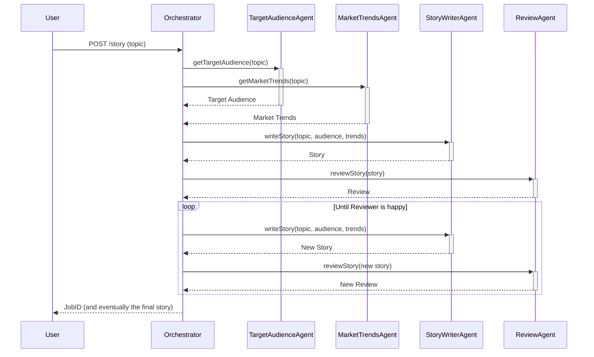

# Java Agent

This project implements an agentic workflow using a Spring Boot application. It features an `Orchestrator` that manages a team of four specialized agents to generate a story based on a given topic.

## Architecture

The workflow is orchestrated as follows:

1.  **Orchestrator**: The central component that manages the entire process.
2.  **Target Audience Agent**: Analyzes and determines the target audience for a story on a given topic.
3.  **Market Trends Agent**: Researches current market trends related to the story's topic.
4.  **Story Writer Agent**: Drafts a story using the topic, target audience, and market trend data.
5.  **Review Agent**: Reviews the story and provides feedback. If the story isn't satisfactory (i.e., the review doesn't contain the word "happy"), the process iterates between the writer and reviewer until it is.

### Workflow Diagram



## Prerequisites

Before running the application, you need to set the `OPENAI_API_KEY` environment variable. You can do this by creating a `.env` file in the root of the project with the following content:

```
OPENAI_API_KEY=your-api-key
```

Replace `your-api-key` with your actual OpenAI API key.

## Building the Project

To build the project, run the following command:

```bash
./mvnw clean install
```

## Running the Application

To run the application, use the following command:

```bash
java --enable-preview -jar target/java-agent-0.0.1-SNAPSHOT.jar
```

## Testing the Application

To test the application, you can use the following `curl` commands:

**1. Submit a story request:**

```bash
curl -X POST http://localhost:8080/story \
-H "Content-Type: application/json" \
-d '{"topic": "a cat who wants to be a pilot"}'
```

This will return a JSON response with a `jobId`.

**2. Poll for the result:**

Replace `{jobId}` with the ID you received from the first command:

```bash
bash
curl http://localhost:8080/story/{jobId}
```

Keep polling this endpoint until the `status` is "COMPLETED". The `result` field will then contain the generated story and the review history.

## Health Endpoint

To check the health of the application, you can use the following `curl` command:

```bash
curl http://localhost:8080/actuator/health
```

